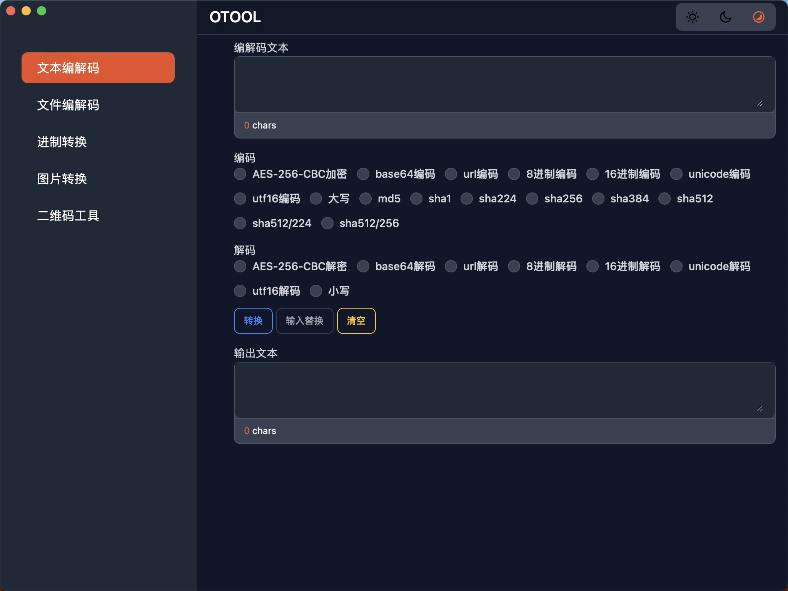
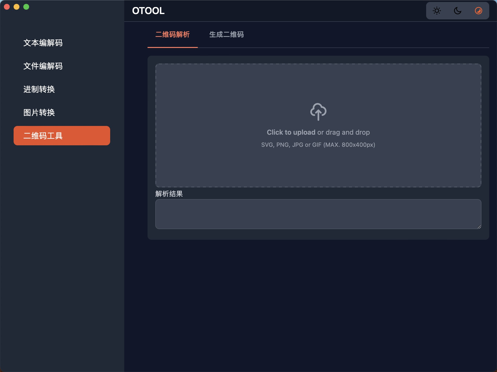

# otool
> 文本、文件加解密，图片转换、二维码工具

### Overview
otool 是一个文本、文件加解密，数字进制转换、图片转换、二维码工具，支持多种加密算法，支持多种图片格式转换，支持二维码解析以及生成。

### 构建命令
* windows amd64: `wails build -platform=windows/amd64`
* windows arm64: `wails build -platform=windows/arm64`
* mac: `wails build -platform=darwin`
* mac intel chip: `wails build -platform=darwin/amd64`
* mac M chip: `wails build -platform=darwin/arm64`
* linux amd64: `wails build -platform=linux/amd64`
* linux arm64: `wails build -platform=linux/arm64`

### Development
otool使用Wails构建，前端使用SvelteKit，后端使用Go。
